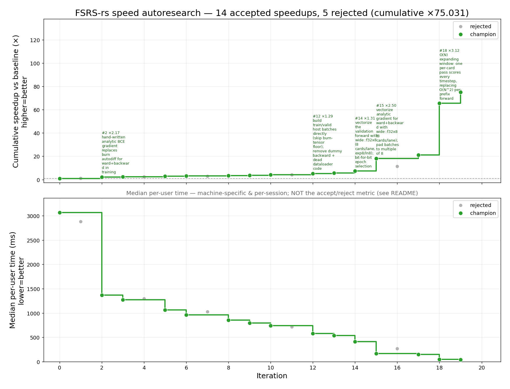

# fsrs-rs-speed-autoresearch

An **autoresearch loop** that makes [FSRS-rs](https://github.com/open-spaced-repetition/fsrs-rs) parameter optimization **faster** — so real Anki users spend less time waiting on the optimizer — **without making it less accurate**. An AI agent (Claude) proposes a change, measures it under a strict protocol, and keeps it only if it clears both the speed and the correctness bars. Inspired by AlphaEvolve and [Andrej Karpathy's "autoresearch" repo](https://github.com/karpathy/autoresearch). Also check out [my other autoresearch repo](https://github.com/Expertium/fsrs-autoresearch).

[](result/history_plot.png)

*Each point is an accepted change: the agent measures a candidate against the current champion and keeps it only if the typical (median) user's optimization gets faster with no loss of accuracy. The top panel is the compounding median speedup vs the original baseline; see [**Tracking progress**](#tracking-progress) for how to read it.*

> **🤖 Working on this repo (human or AI)? Read [`CLAUDE.md`](CLAUDE.md) first.**
> It is the authoritative spec — the goal, the exact measurement protocol, the hard constraints and acceptance bars, an annotated map of the code, and current profiling findings. This README is just the human-facing quickstart.

## The idea

The function being optimized is the Rust `compute_parameters()` in [`fsrs-rs/`](fsrs-rs) (exposed to Python via [`fsrs_rs_python/`](fsrs_rs_python)) — the same routine Anki runs when a user optimizes their FSRS parameters. Two harnesses drive it:

| Harness | Role |
| --- | --- |
| **`compute_parameters.py`** | The **speed** harness the campaign optimizes: times `compute_parameters()` per user (min of 3 runs) and scores it with Rust `evaluate()`, train set == test set. |
| **`benchmark.py`** | The **reference** harness (5-fold TimeSeriesSplit + Python forgetting curve), used with `evaluate.py` for the bit-for-bit correctness check. |

A candidate is **accepted only if** the median user gets **≥5% faster** *and* accuracy stays within the correctness bars (identical results for math-preserving changes; for precision-trading ones the aggregate log loss must stay within an absolute **±0.0015 of the original baseline** — i.e. `compute_parameters.py` mean LogLoss in **[0.3083, 0.3113]**), and the speedup out-runs any added code complexity (`complexity.py`). The precise definitions live in [`CLAUDE.md`](CLAUDE.md).

## Setup

1. **Dataset** — [open-spaced-repetition/anki-revlogs-10k](https://huggingface.co/datasets/open-spaced-repetition/anki-revlogs-10k). Put it next to this repo at `../anki-revlogs-10k` (or pass `--data <path>`); the loaders read `revlogs/user_id=*`.
2. **Dependencies** — [uv](https://docs.astral.sh/uv/) manages the Python env and builds the Rust `fsrs_rs_python` extension:
   ```bash
   uv sync
   ```

## Running

**Speed harness** — the canonical 50-user timing run the campaign uses:
```bash
uv run compute_parameters.py --algo FSRS-rs --short --secs --recency --processes 10 --max-user-id 50
```
Per-user times (ms) are written to `result/compute_parameters-FSRS-rs-short-secs-recency.jsonl`. For the full measurement protocol (min-of-3, median-of-ratios accept metric, noise floor), see *Measurement protocol* in [`CLAUDE.md`](CLAUDE.md).

#### Low-noise measurement (Windows)

Timing noise muddies the ≥5% accept bar, so the campaign runs the speed harness at high priority pinned to specific cores. On Windows:

```bat
start /high /affinity 0xFFFFFFF0 python compute_parameters.py --algo FSRS-rs --short --secs --recency --processes 10 --max-user-id 50
```

- `/high` raises the process priority; `/affinity 0xFFFFFFF0` keeps the workers **off logical CPUs 0–3** (the four cleared low bits of the mask), where the OS and background apps tend to land. On top of that, `compute_parameters.py` pins each worker to its own pair of cores, so cross-worker contention stays constant instead of random.

And pin the CPU clock so turbo/thermal drift can't change the timings between runs (cap the max and min processor state at 99%, which disables turbo and holds the clock flat):

```bat
powercfg /setacvalueindex SCHEME_CURRENT SUB_PROCESSOR PROCTHROTTLEMAX 99
powercfg /setacvalueindex SCHEME_CURRENT SUB_PROCESSOR PROCTHROTTLEMIN 99
powercfg /setactive SCHEME_CURRENT
```

If you want to reduce the noise further, you can:

1. Turn off as many programs as you can. I didn't do that because I still want to use my PC for other things.
2. Lock CPU fan speed and CPU voltage in BIOS. I just didn't want to bother.

**Reference / correctness harness:**
```bash
uv run benchmark.py                  # basic run
uv run benchmark.py --default        # evaluate default params (no per-user training)
uv run benchmark.py --max-user-id 100
uv run benchmark.py --processes 4
```

### Common `benchmark.py` options

Run `uv run benchmark.py --help` for the full list.

| Flag | Description | Default |
| --- | --- | --- |
| `--processes` | Number of worker processes. | `8` |
| `--data` | Path to `revlogs/*.parquet`. | `../anki-revlogs-10k` |
| `--max-user-id` | Maximum user ID to process (inclusive). No limit if unset. | unset |
| `--default` | Evaluate default parameters without per-user training. | off |
| `--n_splits` | Number of TimeSeriesSplit folds. | `5` |
| `--short` | Include short-term reviews. | off |
| `--secs` | Use `elapsed_seconds` as the interval instead of days. | off |
| `--recency` | Recency-weight the training items. | off |
| `--raw` | Save raw per-review predictions to `raw/<name>.jsonl`. | off |
| `--file` | Save per-user evaluation results to `evaluation/<name>/`. | off |

## Tracking progress

`plot_history.py` reads `result/history.jsonl` and renders two stacked views vs iteration to `result/history_plot.png`:

```bash
uv run plot_history.py
```

The [plot at the top of this README](#fsrs-rs-speed-autoresearch) shows two stacked panels:

1. **Cumulative speedup** — the running product of the accepted iterations' median `speed_ratio`. This is the accept metric (the median of per-user speed ratios) compounded, so it's what "progress" means here, and it's drift-immune. Only the **top-5 biggest wins** are labelled with their summary, to keep the panel readable.
2. **Median per-user time (ms)** — intuitive, but **machine-specific and measured per session, so it is *not* the metric used to accept or reject candidates** (each candidate is judged by its median per-user speed ratio, re-measured against the champion in the same session). Treat the time curve as informational context only.

### Why the cumulative number is slightly optimistic (winner's curse)

The top-panel cumulative speedup is a **product of measured ratios**, and that product is **biased a little high** — it overstates the true speedup. Two effects compound:

1. **Selection bias (the "winner's curse").** A candidate is kept only if its *measured* median speedup clears the bar (≥ 1.05). But each measurement carries ~1% noise, so the bar acts as a filter that preferentially admits iterations whose noise happened to land *favorably*. A change whose true speedup is 1.045 but measured 1.055 gets accepted and recorded at 1.055; the symmetric unlucky case (true 1.055, measured 1.045) gets rejected and never counted. So the accepted ratios skew high — you're looking at the winners, and winners are lucky on average.
2. **Noise compounds multiplicatively.** Each `speed_ratio` is a ratio of two noisy timings (~1% each). The cumulative line multiplies ~15 of these together, so the small upward biases multiply too, and the gap grows as the campaign gets longer.

**The honest fix is to re-anchor.** Every ~10–20 iterations we measure the *current champion directly against the original iter-0 baseline*, back-to-back in one session. That single ratio is **unbiased** — there's no accept/reject filter applied to it, so no selection creeps in — and it's drift-immune (same session). The distance between the product line and that anchor point is exactly the accumulated inflation. (For example: at iter 18 the product line read ×65.5, but the direct iter-0 anchor was ×62.0 — about 5–6% optimistic. The anchor is the number to trust; the final report re-validates the champion on 1000 users.)

## Repo tour

`compute_parameters.py` (speed harness) · `benchmark.py` (reference) · `fsrs-rs/src/{model,training,inference}.rs` (the Rust FSRS crate — the optimization target) · `fsrs_rs_python/` (PyO3 binding) · `features/` (review preprocessing) · `complexity.py` (the complexity score) · `profiling/` (profiling tools). The full annotated map is the *Code layout* section of [`CLAUDE.md`](CLAUDE.md).
